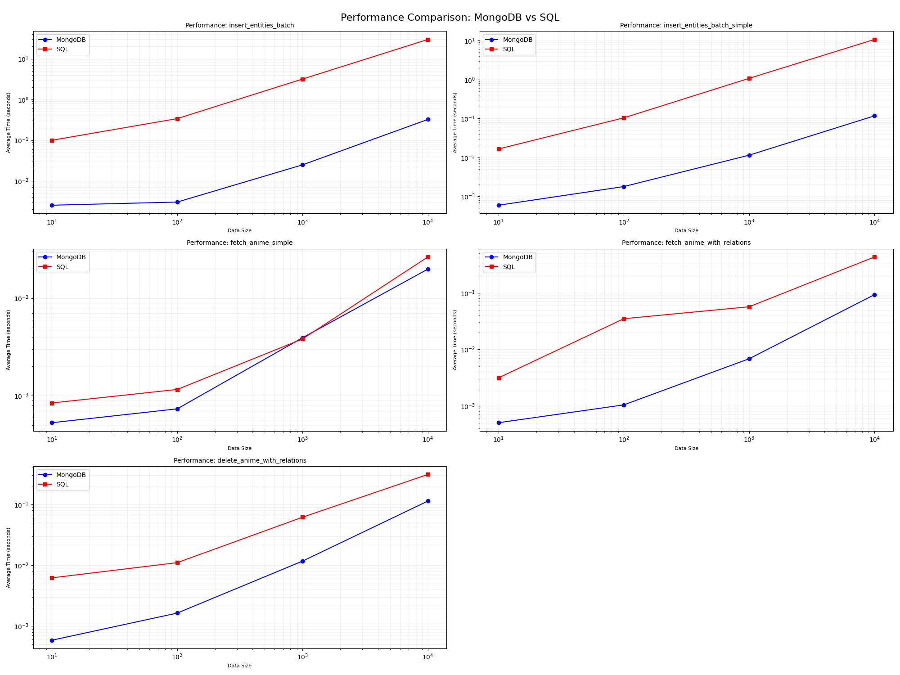

# **Звіт: Порівняння продуктивності MongoDB та MS SQL**

## **1. Теоретична частина**

### **1.1 Вибір NoSQL бази**
MongoDB було обрано як NoSQL базу для тестування завдяки її популярності, простоті використання і підтримці збереження документів у форматі JSON-подібних структур. MongoDB особливо добре підходить для задач із гнучкою структурою даних, таких як зберігання аніме разом із жанрами, оглядами, фото чи мультимедійними елементами.

### **1.2 Вибір SQL бази**
MS SQL обрано як реляційну базу для тестування, оскільки вона забезпечує потужні можливості для складних запитів, цілісність даних через ключі та підтримку ACID-принципів.

---

## **2. Практична частина**

### **2.1 Архітектура даних**

#### **MongoDB**
У MongoDB всі дані зберігалися в одній колекції `anime`. Кожен документ мав наступну структуру:
```json
{
    "_id": "ObjectId",
    "title": "string",
    "original_title": "string",
    "year": "integer",
    "synopsis": "string",
    "episodes": "integer",
    "duration": "integer",
    "is_deleted": "boolean",
    "created_at": "datetime",
    "updated_at": "datetime",
    "updated_by": "integer",
    "genres": ["string"],
    "reviews": [
        {
            "user_id": "integer",
            "rating": "integer",
            "content": "string",
            "created_at": "datetime",
            "updated_at": "datetime"
        }
    ]
}
```
Завдяки цьому вся інформація про жанри й огляди була доступна в одному запиті, що усуває необхідність виконання JOIN-запитів.

---

#### **MS SQL**

Реляційна база складалася з таких таблиць:

1. **Anime**  
   Зберігає основну інформацію про аніме (наприклад, `title`, `year`, `synopsis`, `episodes`, `duration`).

2. **Review**  
   Відображає зв’язок _one-to-many_ між аніме та оглядами.

3. **Genre**  
   Відображає список жанрів, а також їхній зв’язок із аніме через проміжну таблицю `AnimeGenre` (_many-to-many_).
### **3. Результати тестування**

#### **3.1 Опис тестів**
Для порівняння продуктивності було проведено наступні операції:

- **Вставка даних**  
  Масова вставка записів (*batch insert*).

- **Пошук даних**  
  - Простий пошук за параметрами (наприклад, пошук аніме за назвою чи роком).  
  - Пошук із відношеннями (пошук аніме разом із жанрами та оглядами).

- **Видалення даних**  
  Логічне видалення записів із оновленням відповідних полів.

Для кожного тесту використовувалися дані різних розмірів (10, 100, 1,000, 10,000 записів), а також виконувалося по 5 ітерацій, щоб мінімізувати вплив випадкових затримок.

---

#### **3.2 Графіки продуктивності**
Нижче зображено графіки результатів тестування:



#### **3.3 Аналіз результатів**

##### **1. Вставка даних**
- **MongoDB**  
  Швидкість вставки вища для всіх розмірів даних завдяки відсутності суворої схеми та підтримці batch-операцій на рівні документів.
  
- **MS SQL**  
  Вставка даних була повільнішою через додаткові операції перевірки цілісності даних (наприклад, підтримка зовнішніх ключів для зв’язків).

##### **2. Пошук даних**
- **Простий пошук**  
  - **MongoDB**: Покращена швидкість завдяки індексації документів і простій структурі зберігання.  
  - **MS SQL**: Виконувала запити трохи повільніше через необхідність обробки кількох таблиць.

- **Пошук із відношеннями**  
  - **MongoDB**: Структура "все в одному документі" дозволяє уникнути JOIN-операцій, що значно пришвидшує запити.  
  - **MS SQL**: JOIN-запити додавали значний час виконання, особливо на великих об’ємах даних.

##### **3. Видалення даних**
- **MongoDB**  
  Завдяки гнучкій моделі документів логічне видалення виконувалось швидше.

- **MS SQL**  
  Видалення передбачало більшу кількість операцій (наприклад, оновлення кількох таблиць, якщо є зовнішні ключі).

---

### **4. Висновок**

#### **MongoDB**
**Переваги:**
- Висока швидкість вставки та видалення даних завдяки гнучкій моделі.
- Ефективність у запитах, які потребують отримання всіх пов’язаних даних одразу (наприклад, аніме разом із жанрами й оглядами).
- Ідеальний вибір для задач із слабо структурованими даними, наприклад, коли додатково потрібно зберігати мультимедіа (зображення чи відео).

**Недоліки:**
- Відсутність потужних механізмів для складних запитів або аналітичних операцій.
- Залежність продуктивності від правильної організації індексів.

#### **MS SQL**
**Переваги:**
- Потужна підтримка складних запитів і транзакцій.
- Чітке забезпечення цілісності даних через зв’язки між таблицями.
- Краща продуктивність у задачах із великою кількістю відношень.

**Недоліки:**
- Повільніша вставка та видалення великих об’ємів даних через суворість схеми та перевірки.

---

### **Рекомендації**
- Для проектів, де важлива швидкість, гнучкість структури даних або можливість швидкого масштабу — **MongoDB** є оптимальним вибором.
- Для проектів, де необхідна висока цілісність даних і складні запити, краще використовувати **MS SQL**.

Тестування показало, що MongoDB значно перевершує MS SQL у задачах, пов’язаних із великими об’ємами простих операцій, проте MS SQL залишається потужнішим інструментом для реляційних операцій і складних аналітичних запитів.
